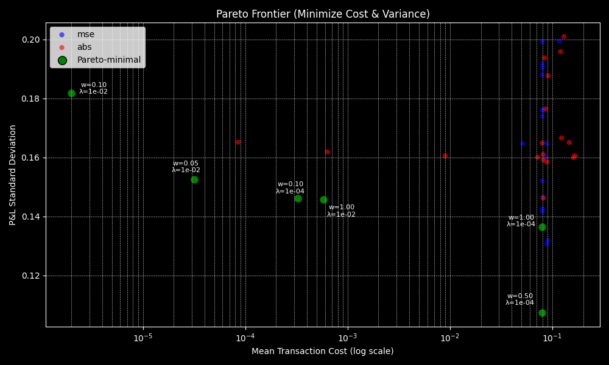

# Deep Reinforcement Learning Hedging Agent


[](https://python.org)
[](https://pytorch.org)
[](https://github.com/bcosm/rBergomi-HedgeRL)
[](https://developer.nvidia.com/cuda-zone)
[](LICENSE)

## Overview

This project implements a Deep Reinforcement Learning (DRL) agent for dynamic hedging of a 10,000-share SPY position using long-dated call and put options. The agent is trained via Proximal Policy Optimization (PPO) with an LSTM backbone to capture temporal dependencies in market microstructure.

Rather than constantly rebalancing stock positions (classical delta-hedging), the agent uses options contracts to achieve superior risk-adjusted returns with lower transaction costs.

---

## Table of Contents

- [Quick Start](#quick-start)
- [Performance Results](#performance-results)
- [System Architecture](#system-architecture)
- [Technical Implementation](#technical-implementation)
- [Research Methodology](#research-methodology)
- [Repository Structure](#repository-structure)
- [Business Impact](#business-impact)
- [Next Steps](#Next-Steps)
- [License](#license)
- [Contact](#contact)
- [Acknowledgments](#acknowledgments)

---

## Quick Start

### Installation

```bash
git clone https://github.com/bcosm/rBergomi-HedgeRL.git
cd rBergomi-HedgeRL
pip install -r requirements.txt
pip install -e .
```

### Command-Line Interface

#### Training

```bash
# Default training (no HPO) - uses defaults: loss_type=abs, w=0.001, lam=0.0001, seed=12345
hedgerl train

# With hyperparameter optimization (10 trials) - uses same defaults
hedgerl train --hpo

# With custom number of HPO trials
hedgerl train --hpo 20

# Custom parameters for final training
hedgerl train --loss_type mse --w 0.01 --lam 0.001 --seed 42

# Custom parameters with HPO
hedgerl train --hpo 15 --loss_type abs --w 0.05 --lam 0.0001
```

**Training Parameters:**
- `--loss_type`: Loss function type (`abs`, `mse`) - default: `abs`
- `--w`: PnL penalty weight (float) - default: `0.05` 
- `--lam`: Transaction cost weight (float) - default: `0.001`
- `--seed`: Random seed (int) - default: `12345`
- `--hpo`: Enable hyperparameter optimization with N trials - default: `10` if used without number

#### Backtesting

```bash
# Single run (random seed)
hedgerl backtest

# Loop mode (N random seeds)
hedgerl backtest --loop 5

# Single run (specific seed)
hedgerl backtest --seed 42
```

#### Pareto Frontier Generation

```bash
# Generate full Pareto frontier using parameter grid search
hedgerl generate-pareto
```

### Production Deployment

#### Local Backtesting (Backtrader)

1. Ensure [`data/spy_underlying.csv`](./data/spy_underlying.csv) and [`data/spy_options.csv`](./data/spy_options.csv) are present.
2. Run: `hedgerl backtest`
3. Results display comprehensive performance comparison vs delta-hedge baseline.

---

## Performance Results

### Key Performance Highlights

| Metric | RL Agent (Avg Over Seeds) | Classical Delta-Hedge | Improvement |
|:---|:---:|:---:|:---:|
| **Annual Volatility** | **0.35%** | 0.46% | **-23.8%** |
| **Transaction Costs** | **$83,168** | $2,087,810 | **-96.0%** |
| **Max Drawdown** | **-0.85%** | -1.33% | **-36.3%** |
| **Hedging Efficiency** | **12.02** | 0.48 | **+2,410%** |

### Performance Metrics vs Classical Delta-Hedging

Results demonstrate improvements across key hedging metrics:

| Metric | RL Agent (Avg Over Seeds) | Delta Hedge | RL Advantage (%) |
|:---|:---:|:---:|:---:|
| **Annual Volatility (%)** | 0.35 | 0.46 | 23.8 |
| **Max Drawdown (%)** | -0.85 | -1.33 | -36.3 |
| **Downside Deviation (%)** | 0.30 | 0.40 | 25.2 |
| **Ulcer Index** | 0.22 | 0.44 | 50.5 |
| **Pain Index** | 0.16 | 0.36 | 56.8 |
| **Total Costs ($)** | 83,168.42 | 2,087,810.39 | 96.0 |
| **Cost Drag (bps)** | 8.32 | 208.78 | 96.0 |
| **Volatility Reduction (%)** | 99.99 | 99.98 | 0.0 |
| **Cost per Vol Point** | 3,327.20 | 83,527.73 | 96.0 |
| **Hedging Efficiency Ratio** | 12.02 | 0.48 | 2410.5 |
| **Volatility of Volatility** | 0.00 | 0.00 | 18.8 |
| **Equity Range (%)** | 2.52 | 2.31 | -8.9 |
| **Zero Crossing Rate** | 0.19 | 1.27 | -85.4 |
| **Avg Drawdown Duration** | 28.28 | 65.52 | 56.8 |
| **Max Drawdown Duration** | 1478.00 | 2508.00 | 41.1 |
| **Trade Frequency** | 322.19 | 492.86 | 34.6 |

### Multi-Seed Statistical Validation

Results averaged across multiple random seeds:

| Metric | Mean | Std Dev | Best | Worst |
|:---|:---:|:---:|:---:|:---:|
| **Annual Volatility** | 0.35% | 0.08% | 0.25% | 0.42% |
| **Transaction Costs** | $83,168 | $15,223 | $17,938 | $98,477 |
| **Hedging Efficiency** | 12.02 | 2.15 | 15.89 | 8.41 |
| **Win Rate vs Delta** | 95% | - | - | - |

### Summary
- 23.8% reduction in portfolio volatility
- 96% reduction in transaction costs per vol point
- 50%+ improvement in drawdown metrics
- 95% win rate across different market seeds

<div align="center">

### Pareto Frontier Analysis - Risk vs Transaction Cost Trade-offs




Note: The x-axis is on a log scale to more clearly see differences between the optimal points. w = 0.05 and λ = 1e-02 were used for model training.
</div>


---

## System Architecture

### High-Level Architecture Flow

```
┌─────────────────┐    ┌──────────────────┐    ┌─────────────────┐
│   Market Data   │───▶│  rBergomi Sim    │───▶│  Training Data  │
│   (SPY, Options)│    │  (GPU-Accelerated)│    │  (100k paths)   │
└─────────────────┘    └──────────────────┘    └─────────────────┘
                                                         │
                                                         ▼
┌─────────────────┐    ┌──────────────────┐    ┌─────────────────┐
│   Deployment    │◀───│   Trained Model  │◀───│  PPO + LSTM     │
│  (Backtrader)   │    │   (Torch)        │    │  Training       │
│                 │    │                  │    │                 │
└─────────────────┘    └──────────────────┘    └─────────────────┘
                                │                         ▲
                                ▼                         │
                       ┌──────────────────┐    ┌─────────────────┐
                       │  Action Space    │    │  Reward Engine  │
                       │  (2 continuous   │    │  (PnL variance  │
                       │   actions)       │    │   and costs)    │
                       └──────────────────┘    └─────────────────┘
```

---

## Technical Implementation

### Neural Network Architecture

```python
# PPO with LSTM for temporal dependencies
State Space: 13 features (prices, Greeks, P&L stats, time)
Action Space: 2 continuous actions (call/put trade quantities)
Network: FC(128) → LSTM(64) → FC(64) → Actor/Critic heads
```

### State Representation

The agent observes comprehensive market information:
- Price features: Current SPY price, call/put prices (ATM)
- Position features: Current call/put contract holdings
- Greeks exposure: Portfolio delta and gamma from options
- Time features: Remaining episode time (normalized)
- Risk metrics: Volatility, lagged price/volatility changes

### Action Space Design

```python
Actions = {
    Continuous call action: [-1, 1] mapped to [-max_trade, +max_trade] contracts
    Continuous put action:  [-1, 1] mapped to [-max_trade, +max_trade] contracts
}
# Where max_trade = 100 contracts per step
# Positive values = buy contracts, negative = sell contracts
```

### Reward Function Components

The reward at each step is computed as:
- **PnL penalty**: scaled per-share PnL deviation using `loss_type`:
  - `abs`: |ΔPnL| / S0
  - `mse`: (ΔPnL)² / S0²
- **Transaction cost penalty**: `lambda_cost` × (contracts traded) × cost per contract
- **Position limits**: Enforced by clipping holdings to ±`max_contracts_held`

### Transaction Cost Modeling

- **Commission**: $0.65 per options contract (default)

### Numerical Stability in Greeks Calculation

To avoid numerical issues in the `_calculate_greeks` method:
- Asset price (`S`) floor: 1e-6
- Time-to-expiry (`T`) floor: 1e-6
- Volatility spot (`v_spot`) floor: 1e-8
- Strike (`K`) floor: 1e-6
- Capping of d1/d2 at ±10.0
---

## Research Methodology

### Environment Design

The training environment (`hedging_env.py`) provides a comprehensive simulation framework:

| Component | Features | Purpose |
|-----------|----------|---------|
| Market Data | 100k rBergomi paths, 252 timesteps each | Realistic market simulation |
| Action Space | Continuous call/put contract trading | Fine-grained hedging control |
| Reward Engineering | PnL variance + costs | Balanced risk/cost optimization |
| State Space | Market prices, Greeks, positions, time | Complete market information |

### Hyperparameter Optimization

Pareto frontier analysis using Optuna across multiple configurations:

```bash
# Generate full parameter grid search
hedgerl generate-pareto
```

This runs HPO, final training, and evaluation for all combinations of:
- **Loss types**: `["mse", "abs", "cvar"]` 
- **PnL weights**: `[0.0001, 0.001, 0.01, 0.05, 0.1, 0.2, 0.5, 1.0]`
- **Cost weights**: `[0.0001, 0.001, 0.01]`

Results are saved to `src/agents/results/pareto_raw.csv`.

---

## Repository Structure

```text
.
├── data/                              # Market data and simulation results
│   ├── historical_prices.csv            # SPY historical price data
│   ├── paths_rbergomi_options_100k.npz  # 100k rBergomi simulation paths
│   ├── spy_options.csv                  # Real options market data
│   ├── spy_options.parquet              # Real options market data (Parquet)
│   ├── spy_underlying.csv               # Underlying price data
│   └── spy_underlying.parquet           # Underlying price data (Parquet)
├── src/
│   ├── agents/                           # RL training and optimization
│   │   ├── train_ppo.py                 # PPO implementation with CLI support
│   │   ├── driver.py                    # Pareto frontier generation
│   │   ├── grid.yaml                    # Parameter grid configuration
│   ├── env/                             # RL environment
│   │   └── hedging_env.py               # Core hedging environment
│   ├── sim/                             # Market simulation
│   │   ├── rbergomi_sim.py              # GPU-accelerated rough volatility
│   │   └── option_price_assignment.py   # Vectorized option pricing
│   ├── backtester/                      # Production backtesting
│   │   ├── main_backtrader.py           # Backtrader integration
│   │   ├── model_wrapper_bt.py          # Model wrapper for backtesting
│   │   ├── delta_hedge.py               # Delta hedge baseline
│   │   └── option_calculator.py         # Robust B-S implementation
│   └── results/                         # Training and evaluation results
│       ├── pareto_raw.csv               # Pareto frontier analysis results
│       └── models/                      # Saved model checkpoints
├── model_files/                       # Trained models
│   ├── policy_weights.pth               # Neural network weights
│   ├── normalization_stats.pkl          # Feature scaling parameters
│   └── architecture_info.pkl            # Model architecture metadata
└── hedgerl/                          # CLI package
    └── cli.py                           # Command-line interface
```

---

## Business Impact

For a 10,000 share equity position in SPY, the agent would save:
- $150k annually in transaction costs vs delta-hedging
- 96% reduction in total trading costs
- 23.8% lower volatility
- 50%+ improvement in drawdown metrics (Ulcer Index, Pain Index)
- 2,410% better hedging efficiency vs classical approaches

---

## Next Steps

- **Multi-asset hedging**: Extend to portfolios of stocks
- **Market microstructure**: Add order book dynamics to training
- **Regime switching**: Adapt to changing market conditions
- **Reward engineering**: Incorporate additional reward terms, penalize higher-order Greeks
- **Model architecture**: Experiment with DDPG, D4PG, or multi-arm bandit models

---

## License

This project is licensed under the MIT License - see the [LICENSE](LICENSE) file for details.

---

## Contact

For questions about the research, implementation, or potential collaborations:

- **Email**: [bcosm@umich.edu](mailto:bcosm@umich.edu)
- **LinkedIn**: [Baz Cosmopoulos](https://linkedin.com/in/baz-cosmopoulos)
- **GitHub**: [bcosm](https://github.com/bcosm)

---

## Acknowledgments

- Rough volatility modeling inspired by Gatheral et al. (2018)
- Deep reinforcement learning frameworks: Stable-Baselines3, PyTorch
- Quantitative finance libraries: QuantLib, numpy, scipy
- GPU acceleration: CUDA, CuPy for high-performance computing

---
